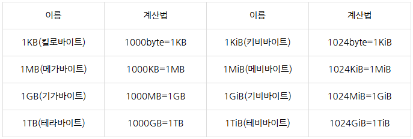
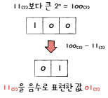
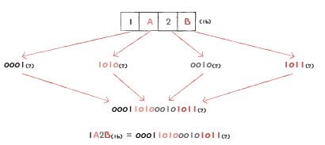

# 0과 1로 숫자를 표현하는 방법

## 핵심 키워드
  - 비트, 바이트, 이진법, 2의 보수, 삼육진법

### 컴퓨터가 표현하는 *정보 단위*를 학습하고, 0과 1만으로 숫자를 표현하는 방법을 배움

#### 정보단위
  - 비트
    * 0과 1을 나타내는 가장 작은 정보 단위
    * 전구(켜짐, 꺼짐)
      * 2개의 전구(비트) = 4가지 정보 표현 가능
      * 3개의 전구(비트) = 8가지 정보 표현 가능
      * n개의 전구로 표현할 수 있는 상태는 2**n가지
        
    
    
    * 프로그램의 크기를 말할 때는 표현의 편의를 위해 비트보다 큰 단위 사용(바이트 제외 이전 단위에 10**3하면 윗 단계 단위)
      * 바이트
        * 8 개의 비트를 묶은 단위
        * 2**8(256)개의 정보 표현가능
      * 킬로바이트
        * 1,000개의 바이트를 묶은 단위
      * 메가바이트
        * 1,000개의 킬로바이트를 묶은 단위
      * 기가바이트
        * 1,000개의 메가바이트를 묶은 단위
      * 테라바이트
        * 1,000개의 기가바이트를 묶은 단위

    tip.
      * 2*10
    
        
  - 워드..
    * cpu가 한 번에 처리할 수 있는 데이터 크기  ex) 한번에 32비트 처리가능하면 1워드는 32비트
    * 하프 워드
    * 풀 워드
    * 더블 워드

#### 이진법
  - 이진법 표기
    * 이진법 -> 이진수
    * 이진수 앞에 (0b)
      * 주로 코드 상에서 표기할 때
    * 이진수 끝에 (2)
      * 주로 수학적으로 표기할 때
  
  - 이진수의 음수 표현
      * 2의 보수
        * 2의 보수란?
          * 어떤 수를 그보다 큰 2**n에서 뺀 값
  
          

        * 쉬운 버전
          * 모든 0과 1은 반전시킨 후(1의 보수) +1(2의 보수)
          * ex) -(-1011)?
        * 2의 보수 표현의 한계
          * 0 -> 1더하기 안함
          * n비트로 -2*.n과 2**n 수를 동시에 표현 못함(자기 자신이 되어버림)
      * 플래그(부가 정보)-4장
        * 컴퓨터 내부에서 양수인지 음수인지 구분하기 위해 사용
        * 표시 해줌
  
  - 십진법 -> 십진수
  
  - 십육진법
    * 십육진법 -> 십육진수
    * 이진법의 숫자 길이가 길어진다는 단점, 이진수 - 십육진수 변환 쉬워 자주 쓰임
    * 십육진수 앞에 (0x)
      * 주로 코드 상에서 표기할 때
    * 십육진수 뒤에 (16)
      * 주로 수학적으로 표기할 때
    * 총 15종류 - 0~9,A~F
  
  - 십육진수를 이진수로 변환하기
    * 십육진수 숫자 하나를 이진수로 표현하려면 4비트 필요(2**4 = 16)
    * 십육진수 한 글자를 4비트의 이진수로 간주 하여 변환 후 이어 붙이면 2진수
  
    

  - 이진수를 십육진수로 변환하기
    * 이진수 숫자를 4개씩 끊고, 십육진수로 변환 후 이어 붙이면 십육진수
      
      

  
  - 마무리
    * 키워드 정리
      * 비트 - 0,1로 표현하는 가장 작은 정보 단위
      * 정보 단위 종류 : 바이트, 킬로바이트, 메가바이트, 테라바이트
      * 이진법 - 0,1만으로 수를 표현하는 방법
      * 2의 보수 - 이진법에서 음수 표현
      * 십육진법 - 1~9, A~F